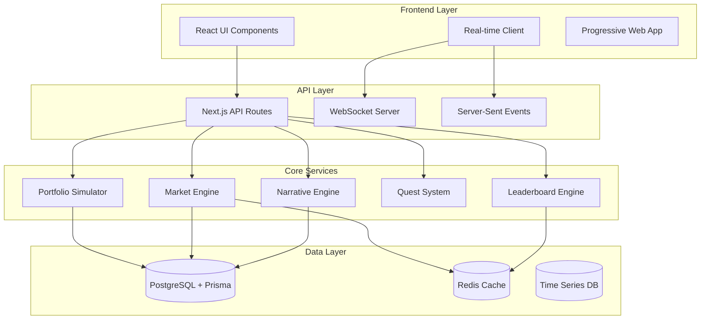
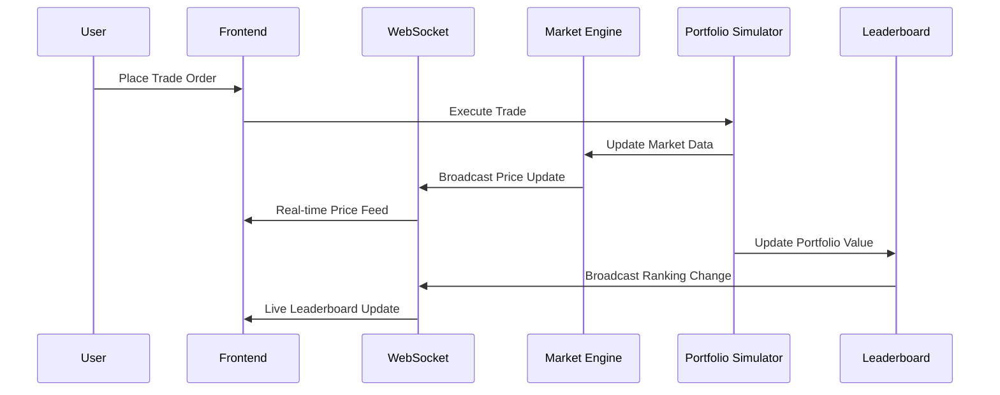

# Echo Markets Alpha Demo - Design Document

## Overview

The Echo Markets Alpha Demo transforms the current trading platform into a compelling, gamified experience that showcases realistic trading mechanics combined with engaging gameplay elements. The design emphasizes real-time competition, social interaction, and progressive learning through an achievement-driven system.

## Architecture

### High-Level System Architecture



### Real-time Data Flow



## Components and Interfaces

### 1. Enhanced Portfolio Simulator

**Purpose:** Core engine managing virtual portfolios, trades, and P&L calculations

**Key Features:**
- Real-time portfolio valuation
- Order execution with realistic latency
- Risk management and position limits
- Performance analytics and metrics

**Interface:**
```typescript
interface PortfolioSimulator {
  executeOrder(order: TradeOrder): Promise<ExecutionResult>
  calculatePortfolioValue(userId: string): Promise<PortfolioValue>
  getPerformanceMetrics(userId: string): Promise<PerformanceMetrics>
  resetDailyPortfolios(): Promise<void>
}

interface TradeOrder {
  userId: string
  symbol: string
  side: 'buy' | 'sell'
  quantity: number
  orderType: 'market' | 'limit'
  limitPrice?: number
}

interface PortfolioValue {
  totalValue: number
  cashBalance: number
  holdingsValue: number
  dayChange: number
  dayChangePercent: number
  positions: Position[]
}
```

### 2. Dynamic Market Engine

**Purpose:** Generates realistic price movements, volatility, and market events

**Key Features:**
- Geometric Brownian Motion for price simulation
- Event-driven volatility spikes
- Sector correlation modeling
- Drama Score calculation

**Interface:**
```typescript
interface MarketEngine {
  generatePriceUpdate(symbol: string): Promise<PriceUpdate>
  triggerMarketEvent(event: MarketEvent): Promise<void>
  calculateDramaScore(): Promise<number>
  getMarketStatus(): Promise<MarketStatus>
}

interface PriceUpdate {
  symbol: string
  price: number
  change: number
  changePercent: number
  volume: number
  timestamp: Date
}

interface MarketEvent {
  type: 'earnings' | 'news' | 'sector_rotation' | 'volatility_spike'
  affectedSymbols: string[]
  impact: number
  narrative: string
}
```

### 3. AI-Powered Narrative Engine

**Purpose:** Creates contextual market commentary and explanatory narratives

**Key Features:**
- Real-time event generation
- Context-aware commentary
- Sentiment analysis integration
- Multi-language support

**Interface:**
```typescript
interface NarrativeEngine {
  generateMarketCommentary(priceData: PriceUpdate[]): Promise<Commentary>
  createEventNarrative(event: MarketEvent): Promise<string>
  analyzeMarketSentiment(): Promise<SentimentScore>
}

interface Commentary {
  id: string
  content: string
  relevantSymbols: string[]
  sentiment: 'bullish' | 'bearish' | 'neutral'
  timestamp: Date
}
```

### 4. Competitive Leaderboard System

**Purpose:** Real-time ranking and competitive features

**Key Features:**
- Live portfolio rankings
- Multiple leaderboard categories
- Historical performance tracking
- Achievement integration

**Interface:**
```typescript
interface LeaderboardEngine {
  updateUserRanking(userId: string, portfolioValue: number): Promise<void>
  getCurrentLeaderboard(category: LeaderboardCategory): Promise<LeaderboardEntry[]>
  getUserRank(userId: string): Promise<UserRanking>
  resetDailyLeaderboard(): Promise<void>
}

interface LeaderboardEntry {
  userId: string
  username: string
  portfolioValue: number
  dayChange: number
  rank: number
  winRate: number
}
```

### 5. Quest and Achievement System

**Purpose:** Gamification through challenges and progression

**Key Features:**
- Daily and weekly quests
- Progressive difficulty
- Skill-based challenges
- Reward system

**Interface:**
```typescript
interface QuestSystem {
  generateDailyQuests(userId: string): Promise<Quest[]>
  checkQuestProgress(userId: string, action: TradingAction): Promise<QuestProgress[]>
  completeQuest(userId: string, questId: string): Promise<Reward>
  getUserAchievements(userId: string): Promise<Achievement[]>
}

interface Quest {
  id: string
  title: string
  description: string
  type: 'trade_volume' | 'profit_target' | 'win_rate' | 'diversification'
  target: number
  reward: Reward
  expiresAt: Date
}
```

## Data Models

### Enhanced Database Schema

```sql
-- Users and Authentication
CREATE TABLE users (
  id UUID PRIMARY KEY DEFAULT gen_random_uuid(),
  email VARCHAR(255) UNIQUE NOT NULL,
  username VARCHAR(50) UNIQUE,
  created_at TIMESTAMP DEFAULT NOW(),
  last_active TIMESTAMP DEFAULT NOW(),
  preferences JSONB DEFAULT '{}'
);

-- Portfolio Management
CREATE TABLE portfolios (
  id UUID PRIMARY KEY DEFAULT gen_random_uuid(),
  user_id UUID REFERENCES users(id),
  session_date DATE NOT NULL,
  starting_cash DECIMAL(15,2) DEFAULT 10000,
  current_cash DECIMAL(15,2),
  total_value DECIMAL(15,2),
  day_change DECIMAL(15,2),
  day_change_percent DECIMAL(5,2),
  created_at TIMESTAMP DEFAULT NOW(),
  updated_at TIMESTAMP DEFAULT NOW()
);

-- Enhanced Holdings
CREATE TABLE holdings (
  id UUID PRIMARY KEY DEFAULT gen_random_uuid(),
  portfolio_id UUID REFERENCES portfolios(id),
  symbol VARCHAR(10) NOT NULL,
  quantity INTEGER NOT NULL,
  average_cost DECIMAL(10,4) NOT NULL,
  current_price DECIMAL(10,4),
  unrealized_pnl DECIMAL(15,2),
  updated_at TIMESTAMP DEFAULT NOW()
);

-- Market Data with Enhanced Metadata
CREATE TABLE market_data (
  id UUID PRIMARY KEY DEFAULT gen_random_uuid(),
  symbol VARCHAR(10) NOT NULL,
  price DECIMAL(10,4) NOT NULL,
  volume INTEGER DEFAULT 0,
  bid DECIMAL(10,4),
  ask DECIMAL(10,4),
  change_24h DECIMAL(10,4),
  change_percent_24h DECIMAL(5,2),
  volatility DECIMAL(5,4),
  timestamp TIMESTAMP DEFAULT NOW(),
  INDEX idx_symbol_timestamp (symbol, timestamp)
);

-- Quest System
CREATE TABLE quests (
  id UUID PRIMARY KEY DEFAULT gen_random_uuid(),
  user_id UUID REFERENCES users(id),
  type VARCHAR(50) NOT NULL,
  title VARCHAR(200) NOT NULL,
  description TEXT,
  target_value DECIMAL(15,2),
  current_progress DECIMAL(15,2) DEFAULT 0,
  status VARCHAR(20) DEFAULT 'active',
  reward_type VARCHAR(50),
  reward_value DECIMAL(15,2),
  created_at TIMESTAMP DEFAULT NOW(),
  expires_at TIMESTAMP
);

-- Leaderboards
CREATE TABLE leaderboard_entries (
  id UUID PRIMARY KEY DEFAULT gen_random_uuid(),
  user_id UUID REFERENCES users(id),
  session_date DATE NOT NULL,
  category VARCHAR(50) NOT NULL,
  score DECIMAL(15,2) NOT NULL,
  rank INTEGER,
  metadata JSONB DEFAULT '{}',
  created_at TIMESTAMP DEFAULT NOW(),
  UNIQUE(user_id, session_date, category)
);

-- Market Events and Narratives
CREATE TABLE market_events (
  id UUID PRIMARY KEY DEFAULT gen_random_uuid(),
  type VARCHAR(50) NOT NULL,
  title VARCHAR(200) NOT NULL,
  description TEXT,
  affected_symbols TEXT[],
  impact_magnitude DECIMAL(5,2),
  sentiment VARCHAR(20),
  created_at TIMESTAMP DEFAULT NOW()
);
```

## Error Handling

### Graceful Degradation Strategy

1. **Real-time Connection Loss:**
   - Fallback to polling for critical data
   - Queue user actions for retry
   - Display connection status indicator

2. **Market Engine Failures:**
   - Use cached price data
   - Implement circuit breaker pattern
   - Graceful error messages

3. **Database Connectivity:**
   - Redis cache as primary fallback
   - Read-only mode during outages
   - Automatic retry with exponential backoff

### Error Recovery Patterns

```typescript
class MarketEngineService {
  private circuitBreaker = new CircuitBreaker(this.generatePrices, {
    timeout: 3000,
    errorThresholdPercentage: 50,
    resetTimeout: 30000
  })

  async getPriceUpdate(symbol: string): Promise<PriceUpdate> {
    try {
      return await this.circuitBreaker.fire(symbol)
    } catch (error) {
      // Fallback to cached data
      return await this.getCachedPrice(symbol)
    }
  }
}
```

## Testing Strategy

### Unit Testing
- **Portfolio Simulator:** Trade execution logic, P&L calculations
- **Market Engine:** Price generation algorithms, volatility models
- **Quest System:** Progress tracking, reward distribution
- **Leaderboard Engine:** Ranking algorithms, performance metrics

### Integration Testing
- **Real-time Data Flow:** WebSocket connections, event broadcasting
- **Database Operations:** Transaction integrity, concurrent access
- **API Endpoints:** Request/response validation, error handling

### Performance Testing
- **Concurrent Users:** 1000+ simultaneous traders
- **Real-time Updates:** Sub-second latency for price feeds
- **Database Load:** High-frequency trading simulation
- **Memory Usage:** Long-running market simulation

### User Experience Testing
- **Onboarding Flow:** New user completion rates
- **Mobile Responsiveness:** Touch interactions, performance
- **Accessibility:** Screen reader compatibility, keyboard navigation

## Performance Considerations

### Real-time Optimization
- **WebSocket Connection Pooling:** Efficient client management
- **Data Compression:** Minimize bandwidth usage
- **Selective Updates:** Only send changed data
- **Client-side Caching:** Reduce server requests

### Database Performance
- **Connection Pooling:** Prisma connection management
- **Query Optimization:** Indexed lookups, efficient joins
- **Caching Strategy:** Redis for frequently accessed data
- **Read Replicas:** Separate read/write workloads

### Scalability Architecture
- **Horizontal Scaling:** Stateless API servers
- **Load Balancing:** Distribute WebSocket connections
- **Microservices:** Independent scaling of core services
- **CDN Integration:** Static asset delivery

## Security Considerations

### Authentication and Authorization
- **JWT Token Management:** Secure session handling
- **Rate Limiting:** Prevent API abuse
- **Input Validation:** Sanitize all user inputs
- **CORS Configuration:** Restrict cross-origin requests

### Data Protection
- **Encryption at Rest:** Database encryption
- **Secure Transmission:** HTTPS/WSS protocols
- **PII Handling:** Minimal data collection
- **Audit Logging:** Track sensitive operations

### Trading Security
- **Order Validation:** Prevent invalid trades
- **Position Limits:** Risk management controls
- **Market Manipulation:** Detection algorithms
- **Fair Play:** Anti-cheating measures

This design provides a comprehensive foundation for building an engaging, scalable, and secure Echo Markets Alpha Demo that delivers on all the specified requirements while maintaining high performance and reliability.