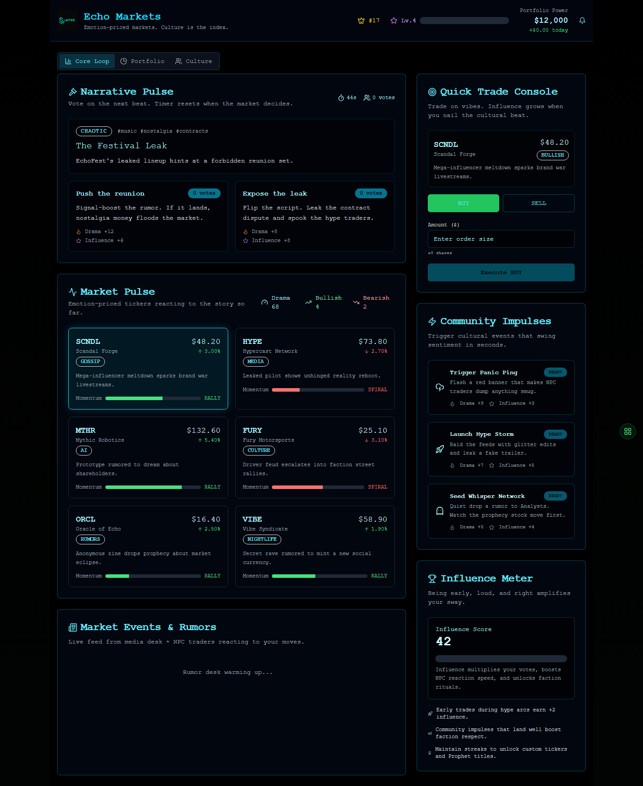
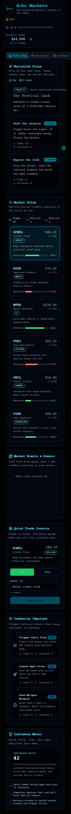
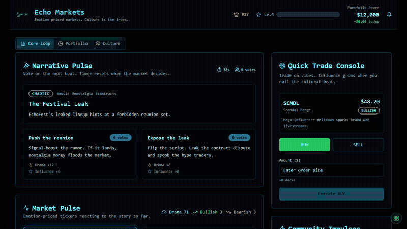

# Echo Markets

Echo Markets is a paper-trading game about market psychology.

Players react to rumor beats, vote on narrative direction, place simulated trades, and watch portfolio value, influence, faction pressure, and market sentiment move together. It is a playable rehearsal loop, not real trading infrastructure.

[Live demo](https://echo-markets-production.up.railway.app)



## What To Look At First

If you are reviewing the repo quickly, start here:

- `app/game/page.tsx` - primary game surface with market pulse, narrative choice, and trade flow.
- `lib/market-engine.ts` - simulated market state and price movement logic.
- `lib/trading.ts` - order validation and execution helpers.
- `lib/demo-responses.ts` - deterministic public-demo fallbacks when database services are unavailable.
- `contexts/portfolio-context.tsx` - client portfolio state.
- `contexts/market-prices-context.tsx` - market price provider.
- `components/portfolio-module.tsx` and `components/trading-module.tsx` - reusable game panels.
- `prisma/schema.prisma` - persistent user, trade, portfolio, leaderboard, and event model.
- `scripts/dev-ticker.mjs`, `scripts/order-matcher.mjs`, and `scripts/narrator.mjs` - background simulation tools.
- `tests/unit/market-engine.test.ts`, `tests/unit/trading.test.ts`, and `tests/integration/market-engine-integration.test.ts` - focused system checks.

## Product Boundary

Echo Markets is intentionally framed as a game:

- No real money.
- No broker connection.
- No investment advice.
- Simulated prices and demo users in the public build.
- Prisma-backed persistence only when a real database is configured.
- Demo fallbacks for public routes when database services are unavailable.

The point is to make market psychology tangible: narrative pressure, position sizing, portfolio movement, and leaderboard behavior in one arcade-like surface.

## Screens

| Desktop | Mobile |
| --- | --- |
|  |  |

Motion capture:



## What Ships

- Browser game UI with market pulse, narrative votes, quick trade console, portfolio state, and faction panels.
- Demo-mode API fallbacks for public deployments without database services.
- Simulated market engine and order execution route.
- Leaderboard and guest-session routes.
- Prisma-backed persistence path for real sessions.
- Redis-ready support for realtime/background state.
- Jest unit and integration tests for market, trading, auth, progression, and portfolio logic.

## Stack

- Next.js 15
- React 19
- TypeScript
- Tailwind
- Prisma/PostgreSQL
- Redis
- Jest
- Railway

## Repository Layout

```text
app/          Next.js app routes and game screens
components/   UI modules and arcade panels
contexts/     React state providers
hooks/        Custom hooks
lib/          Market engine, trading logic, demo fallbacks, auth, DB helpers
prisma/       Schema and migrations
scripts/      Ticker, matcher, narrator, seed, and migration helpers
showcase/     Public proof media
tests/        Unit and integration tests
```

## Run Locally

```bash
corepack pnpm install
corepack pnpm exec prisma generate
corepack pnpm dev
```

For Prisma-backed routes, set `DATABASE_URL`. Without it, public demo routes are expected to use deterministic fallback responses.

Useful checks:

```bash
corepack pnpm test
corepack pnpm build
corepack pnpm dev:ticker
corepack pnpm engine:orders
```

## Public Demo Notes

The hosted demo is a paper-trading prototype. It uses simulated prices and demo users. Public routes should fall back to deterministic demo responses instead of throwing noisy browser errors when database services are not configured.

## Status

Beta. Echo Markets should be described as a simulated market game and portfolio rehearsal surface, not as trading infrastructure.
